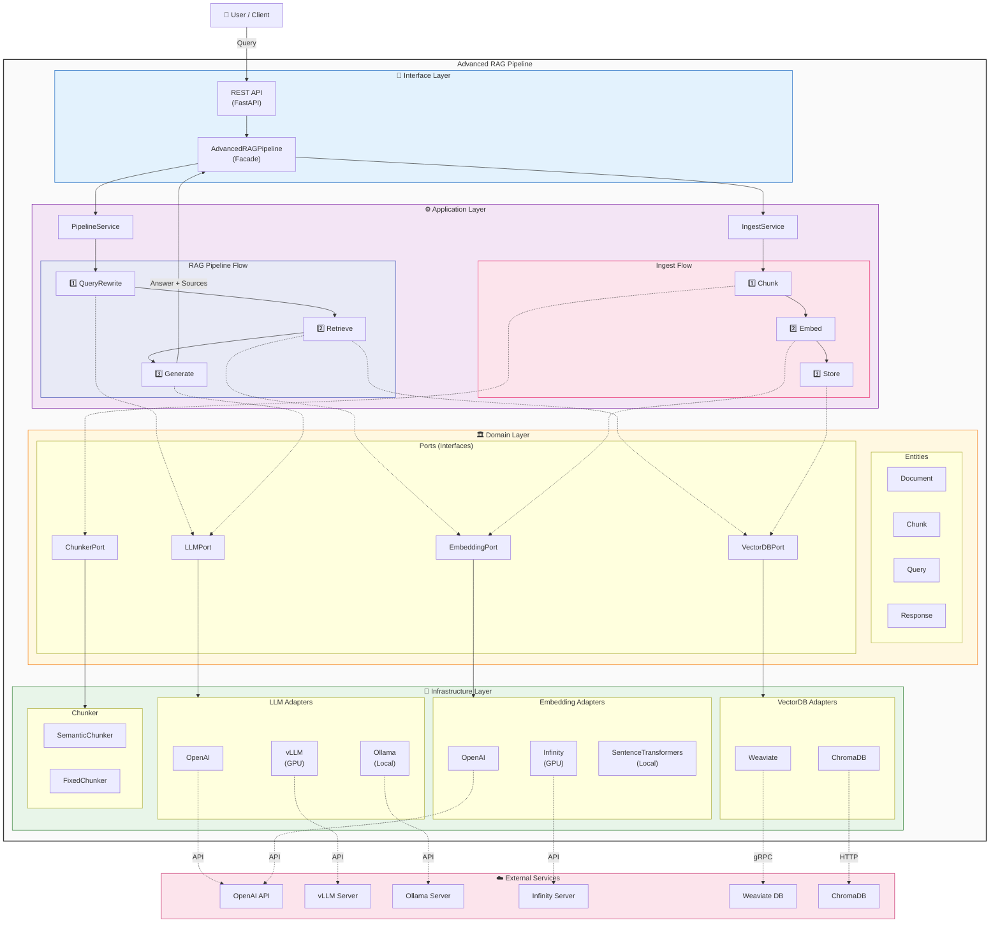
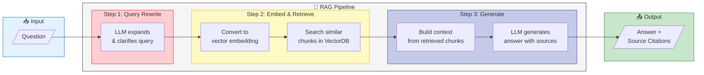
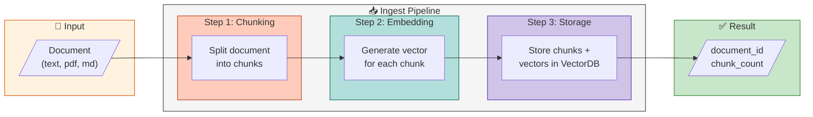
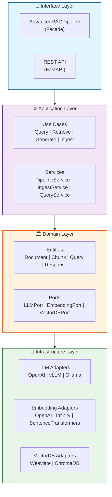
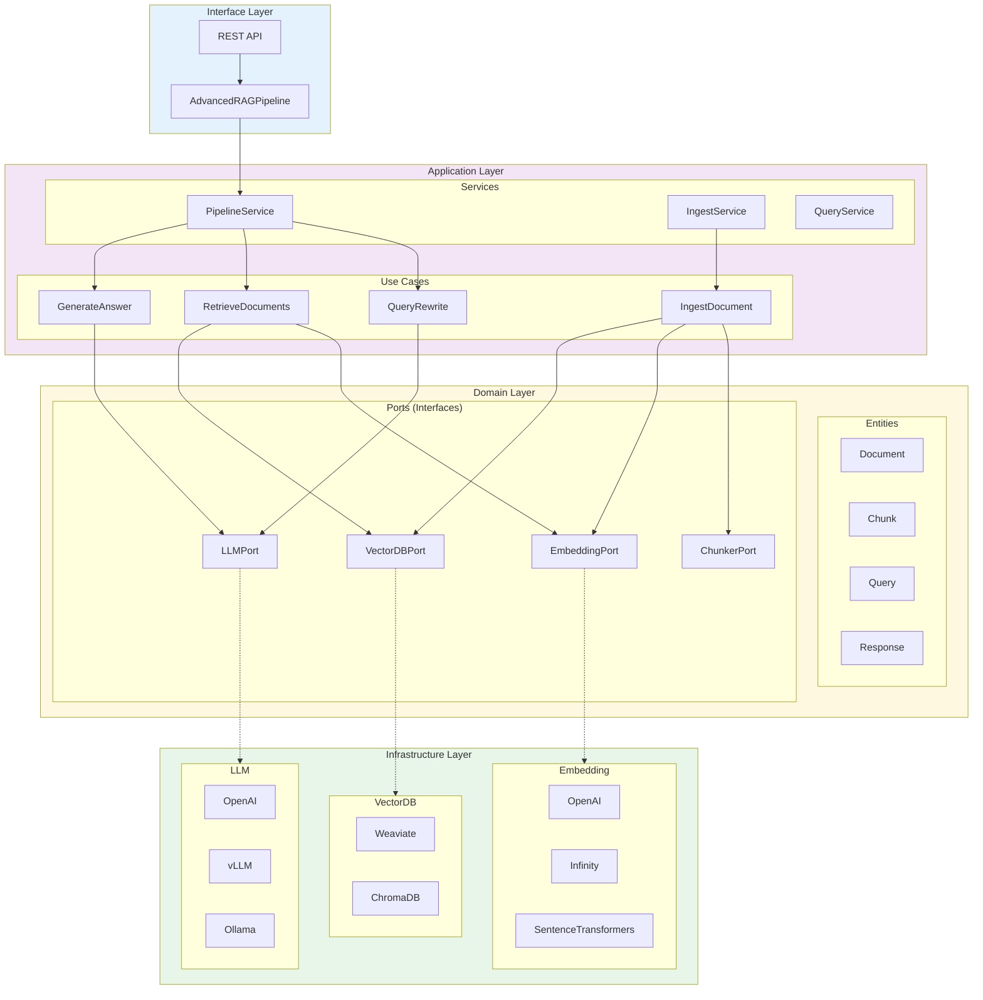
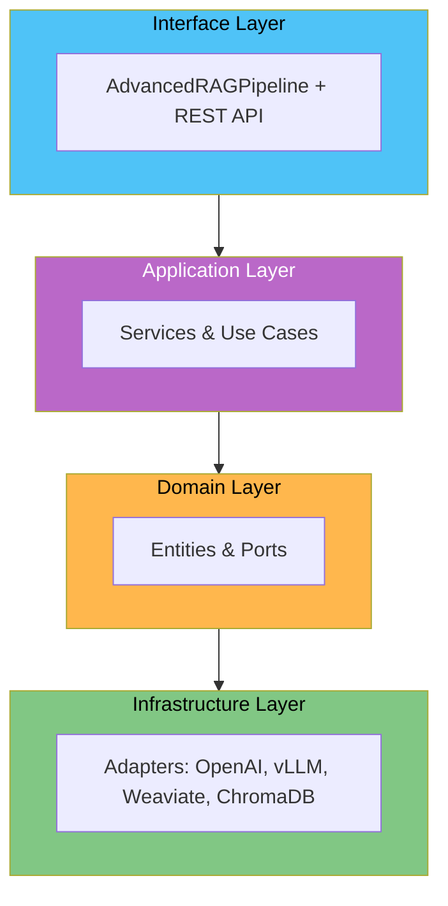
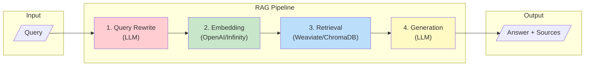
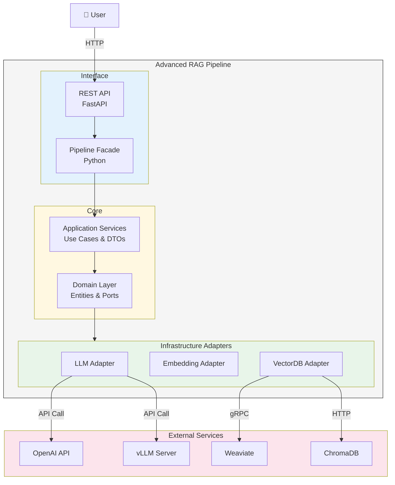

# Architecture Diagrams

Mermaid 차트를 이용한 아키텍처 다이어그램 모음입니다.

---

## Recommended: C4 + RAG Pipeline Flow

Clean Architecture 계층 구조와 RAG 파이프라인 플로우를 함께 표현한 다이어그램입니다.



---

## Simplified: RAG Pipeline Core Flow

RAG 파이프라인의 핵심 데이터 흐름만 표현한 간소화 버전입니다.



---

## Document Ingestion Flow

문서 수집(Ingest) 파이프라인 플로우입니다.



---

## Option 1: 계층형 블록 다이어그램



---

## Option 2: 상세 플로우 다이어그램



---

## Option 3: 심플 버전



---

## Option 4: RAG 파이프라인 플로우



---

## Option 5: C4 스타일 컨테이너 다이어그램



---

## 사용 방법

1. 원하는 다이어그램을 선택합니다
2. [Mermaid Live Editor](https://mermaid.live/)에서 코드를 붙여넣기합니다
3. PNG/SVG로 내보내기합니다
4. `docs/images/` 폴더에 저장 후 README에서 참조합니다

```markdown

```
